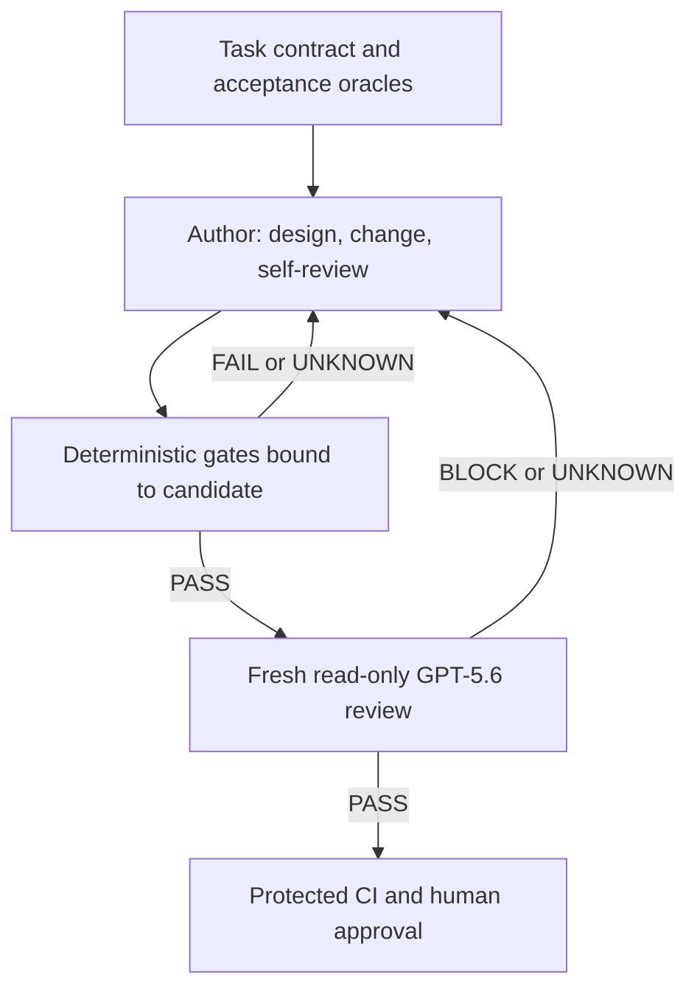

# Codex Governed Change

An implementation-ready blueprint for keeping agentic coding work aligned with repository authority, deterministic quality gates, fresh-context review, and human approval.

The project deliberately does **not** rely on HiveGate. It adapts the useful control principles—fail-closed evidence, exact candidate binding, independent assurance, traceability, and human authority—using ordinary Codex configuration, repository skills, Python, Git, and CI.

## Status

| Area | State | Meaning |
|---|---|---|
| Requirements and architecture | `DESIGN_READY` | The implementation contract is complete enough for a bounded coding run. |
| Production implementation | `NOT_STARTED` | Ports, adapters, CLI, hook and aggregator remain to be implemented. |
| Acceptance suite | `RED_EXPECTED` | Executable acceptance tests define the target behaviour and initially fail. |
| Release readiness | `BLOCK` | No production or enforcement claim is authorized yet. |

See [IMPLEMENTATION_STATUS.md](IMPLEMENTATION_STATUS.md) for the evidence classification and [IMPLEMENT_WITH_GPT_5_6.md](IMPLEMENT_WITH_GPT_5_6.md) for the master implementation prompt.

## The control model

Rules and skills guide the author model; they are not security or quality boundaries. An independent reviewer can veto a candidate but cannot certify it. A deterministic aggregator checks exact candidate identities and evidence. Protected CI and a human own the final decision.



Any candidate change invalidates earlier deterministic evidence and independent review.

## What this repository provides

- A concise repository [`AGENTS.md`](AGENTS.md) and reusable [`governed-change` skill](.agents/skills/governed-change/SKILL.md).
- Code-change and specification-design quality profiles.
- A read-only custom reviewer profile for convenient interactive use.
- A strict fresh-process reviewer contract for `codex exec --ephemeral`.
- JSON Schemas for task contracts, gate results, reviewer results, evidence manifests, and dispositions.
- A domain-first, hexagonal implementation design with explicit ports and adapters.
- An executable acceptance suite containing the red proofs GPT-5.6 must make green.
- A bounded Stop-hook contract that prevents one-turn completion claims without creating infinite loops.
- CI and branch-protection adoption guidance.
- Threat model, RST charters, traceability, implementation tasks, and decision records.

## Intended workflow

1. A human or planning process approves a task contract.
2. The author model implements the smallest coherent candidate.
3. Deterministic gates run and emit candidate-bound artifacts.
4. A new `codex exec` process reviews an immutable snapshot in a read-only sandbox.
5. The deterministic aggregator rejects missing, stale, malformed, failed, timed-out, or conflicting evidence.
6. CI repeats the checks against the immutable commit.
7. A human reviews and decides whether to merge or grant an explicit waiver.

The reviewer receives repository read access, the normalized task contract, candidate identifiers, and raw evidence. It does not receive the author chat, plan, self-review, or conclusions. It searches the full repository as needed but focuses on the exact diff and affected contract/dependency/trust-boundary closure.

## Implement with GPT-5.6

Start a new GPT-5.6 Codex session at the repository root and give it the complete content of [IMPLEMENT_WITH_GPT_5_6.md](IMPLEMENT_WITH_GPT_5_6.md). The prompt requires it to reconstruct context from this repository, execute the red acceptance suite, implement in bounded slices, and obtain a fresh independent review before claiming completion.

Before implementation, verify the blueprint:

```bash
python3 scripts/validate_blueprint.py
```

Then confirm the expected red implementation baseline:

```bash
PYTHONPATH=src python3 -m unittest discover -s tests/acceptance -v
```

The second command is expected to fail until the implementation exists. Do not weaken, skip, delete, or relabel those failures to make the repository appear green.

## Repository map

| Path | Purpose |
|---|---|
| `docs/specification.md` | Normative system specification and scope. |
| `docs/requirements.md` | Stable requirement identifiers and acceptance rules. |
| `docs/architecture.md` | Domain model, ports, adapters and trust boundaries. |
| `docs/implementation-plan.md` | Ordered bounded tasks for GPT-5.6. |
| `docs/test-strategy.md` | Deterministic tests, RST charters, oracles and debrief. |
| `docs/threat-model.md` | Assets, actors, threats and mitigations. |
| `docs/traceability.md` | Requirement-to-test-to-task mapping. |
| `.agents/skills/governed-change/` | Reusable author workflow with progressive disclosure. |
| `.codex/agents/` | Interactive read-only reviewer profile. |
| `.codex/review/` | Fresh reviewer prompt. |
| `schemas/` | Stable machine-readable contracts. |
| `src/codex_governance/` | Hexagonal implementation skeleton. |
| `tests/acceptance/` | Executable target behaviour. |
| `examples/` | Valid reference artifacts and deployment templates. |

## Key non-goals

- Replacing tests, static analysis, security scanners, CI, code owners, or human review with an LLM.
- Claiming statistical independence merely because the reviewer is a second GPT-5.6 instance.
- Sending the entire repository or author transcript as one oversized prompt.
- Giving an LLM merge, waiver, credential, deployment, or policy authority.
- Requiring HiveGate, an MCP server, a database, or a hosted control plane.
- Silently falling back to an in-session subagent when the fresh reviewer cannot run.

## Source basis

The design follows current official guidance for [AGENTS.md](https://learn.chatgpt.com/docs/agent-configuration/agents-md), [skills](https://learn.chatgpt.com/docs/build-skills), [subagents](https://learn.chatgpt.com/docs/agent-configuration/subagents), [hooks](https://learn.chatgpt.com/docs/hooks), [non-interactive Codex](https://learn.chatgpt.com/docs/non-interactive-mode), and the [Codex GitHub Action](https://learn.chatgpt.com/docs/github-action). Research rationale and limitations are recorded in [docs/research.md](docs/research.md).

## License

[MIT](LICENSE)
