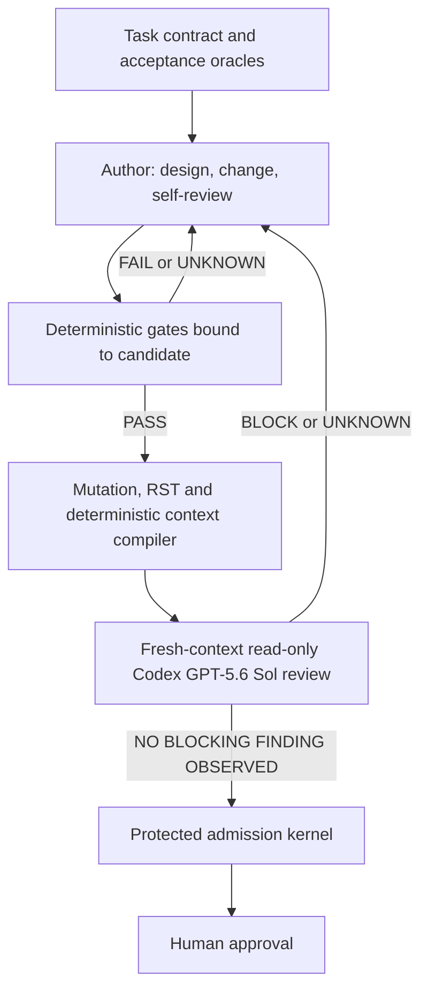

# Codex Governed Change

A standalone implementation candidate for keeping agentic coding work aligned
with protected repository authority, sandboxed deterministic quality gates,
fresh-context review, and human approval.

The project deliberately does **not** rely on HiveGate. It adapts useful control
principles—fail-closed evidence, exact repository/candidate binding, bounded
fresh-context assurance, traceability, and human authority—using ordinary Codex
configuration, repository skills, Python, Git, a local sandbox provider, and CI.

## Status

| Area | State | Meaning |
|---|---|---|
| Requirements and architecture | `HARDENED_CONTRACT` | Sixty-six requirements define the protected architecture and token-aware assurance boundary. |
| Production implementation | `T01–T23 IMPLEMENTED` | The standalone CLI, admission kernel, sandbox boundary, evidence reconstruction, mutation, RST, context and reviewer adapters are implemented. |
| Acceptance suite | `GREEN_LOCAL` | 174 unit and acceptance tests pass locally without skips or expected failures. |
| Final qualification | `T24 UNKNOWN` | A protected real-container run, labelled live reviewer qualification, exact-candidate fresh review and hosted CI reconstruction have not been completed. |
| Release readiness | `BLOCK` | Local deterministic success is not release or merge authority. |

See [IMPLEMENTATION_STATUS.md](IMPLEMENTATION_STATUS.md) for the evidence classification and [IMPLEMENT_WITH_GPT_5_6.md](IMPLEMENT_WITH_GPT_5_6.md) for the master implementation prompt.

## The control model

Rules and skills guide the author model; they are not security or quality
boundaries. A qualified fresh-context reviewer can veto a candidate but cannot
certify it. One protected deterministic admission kernel checks the exact
assurance case. Protected CI and a human own the final decision.



Any candidate change invalidates earlier deterministic evidence and fresh-context review.

## What this repository provides

- A concise repository [`AGENTS.md`](AGENTS.md) and reusable [`governed-change` skill](.agents/skills/governed-change/SKILL.md).
- Code-change and specification-design quality profiles.
- A read-only custom reviewer profile for convenient interactive use.
- A strict fresh-process reviewer contract for `codex exec --ephemeral`.
- JSON Schemas for authenticated decisions, provenance, sandbox capability,
  assurance cases, RST, mutation, context receipts, reviewer qualification and dispositions.
- A domain-first, hexagonal implementation design with explicit ports and adapters.
- An executable acceptance suite covering deterministic and fail-closed behavior.
- A bounded Stop-hook contract that prevents one-turn completion claims without creating infinite loops.
- CI and branch-protection adoption guidance.
- Threat model, RST charters, traceability, implementation tasks, and decision records.

## Intended workflow

1. A human or planning process approves a task contract.
2. The author model implements the smallest coherent candidate.
3. Deterministic gates run in a disposable no-secret/no-network sandbox.
4. Trusted packaging emits repository/candidate-bound provenance and write-once evidence.
5. Curated mutation and operational RST run before model review.
6. The deterministic context compiler creates an auditable risk-selected projection.
7. A qualified new `codex exec` process reviews an immutable read-only snapshot.
8. The protected admission kernel rejects any missing, stale, malformed, failed,
   timed-out, conflicting or unresolved prerequisite.
9. A human reviews and decides whether to merge or issue protected authority.

The reviewer receives repository read access, the normalized task contract, candidate identifiers, and raw evidence. It does not receive the author chat, plan, self-review, or conclusions. It searches the full repository as needed but focuses on the exact diff and affected contract/dependency/trust-boundary closure.

## Verify the implementation candidate

Verify blueprint and implementation behavior:

```bash
python3 scripts/validate_blueprint.py
```

```bash
PYTHONPATH=src python3 -m unittest discover -s tests -v
```

Both commands must pass. The local semantic corpus can then be run as diagnostic
proof with `PYTHONPATH=src python3 scripts/run_mutation_corpus.py`; its output
explicitly does not replace sandbox provenance or admission evidence.

## Repository map

| Path | Purpose |
|---|---|
| `docs/specification.md` | Normative system specification and scope. |
| `docs/requirements.md` | Stable requirement identifiers and acceptance rules. |
| `docs/architecture.md` | Domain model, ports, adapters and trust boundaries. |
| `docs/implementation-plan.md` | Ordered bounded tasks for Codex GPT-5.6 Sol. |
| `docs/test-strategy.md` | Deterministic tests, RST charters, oracles and debrief. |
| `docs/threat-model.md` | Assets, actors, threats and mitigations. |
| `docs/traceability.md` | Requirement-to-test-to-task mapping. |
| `.agents/skills/governed-change/` | Reusable author workflow with progressive disclosure. |
| `.codex/agents/` | Interactive read-only reviewer profile. |
| `.codex/review/` | Fresh reviewer prompt. |
| `schemas/` | Stable machine-readable contracts. |
| `src/codex_governance/` | Domain, adapters and standalone orchestration implementation. |
| `tests/acceptance/` | Executable target behaviour. |
| `examples/` | Valid reference artifacts and deployment templates. |

## Key non-goals

- Replacing tests, static analysis, security scanners, CI, code owners, or human review with an LLM.
- Claiming statistical independence merely because the reviewer is a second Codex GPT-5.6 Sol instance.
- Sending the entire repository or author transcript as one oversized prompt.
- Giving an LLM merge, waiver, credential, deployment, or policy authority.
- Requiring HiveGate, an MCP server, a database, or a hosted control plane.
- Silently falling back to an in-session subagent when the fresh reviewer cannot run.

## Source basis

The design follows current official guidance for [AGENTS.md](https://learn.chatgpt.com/docs/agent-configuration/agents-md), [skills](https://learn.chatgpt.com/docs/build-skills), [subagents](https://learn.chatgpt.com/docs/agent-configuration/subagents), [hooks](https://learn.chatgpt.com/docs/hooks), [non-interactive Codex](https://learn.chatgpt.com/docs/non-interactive-mode), and the [Codex GitHub Action](https://learn.chatgpt.com/docs/github-action). Research rationale and limitations are recorded in [docs/research.md](docs/research.md).

## License

[MIT](LICENSE)
