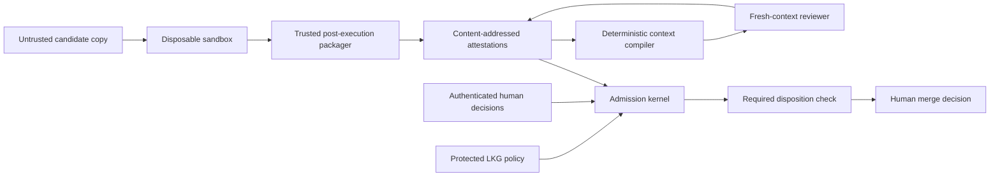

# Architecture hardening delta

Status: historical normative hardening input. Its T13–T23 corrections are now
present in the implementation candidate; final T24 qualification remains blocked.

## Baseline facts

The preserved working candidate contains partial T01–T12 implementation. On
2026-08-26 the following local, mutable-working-copy checks completed with exit
zero:

```text
python3 scripts/validate_blueprint.py
PYTHONPATH=src python3 -m unittest discover -s tests/acceptance -v
```

The first command reported 40 mapped requirements and 14 schema/example pairs.
The second discovered 49 passing tests. These results are provisional baseline
observations, not protected admission evidence. New hardening oracles are
expected to become red before their implementations are added.

## Trusted computing base

The minimum trusted computing base (TCB) is:

| Component | Authority owner | Required property |
|---|---|---|
| Last-known-good (LKG) governance commit | Protected repository maintainers | Selects the policy that evaluates its proposed replacement |
| Admission kernel and pure domain rules | LKG governance source | Sole deterministic readiness calculation; fail closed |
| Repository/candidate identity and canonicalization | LKG governance source | Stable repository binding and exact candidate currentness |
| Schema, semantic and evidence-locator verifier | LKG governance source | Rejects malformed, unresolved or incompatible representations |
| Artifact and attestation verifier | LKG governance source | Content-addressed, write-once and provenance checked |
| Gate supervisor | LKG governance source | Keeps untrusted execution outside protected paths and evidence authority |
| CI runner and sandbox mechanism | Deployment operator | Supplies the declared isolation capabilities |
| Fixed reviewer rubric, context compiler and launcher | LKG governance source | Fresh-context, allowlisted, auditable model input |
| Required-check/ruleset configuration | Repository administrator | Requires the expected check source with no silent bypass |
| Authenticated human-decision source | Repository organization | Owns task approval, governance promotion, risk acceptance and waivers |

The TCB excludes candidate code, candidate tests, task or model prose,
candidate-owned workflow/configuration, reviewer conclusions, raw gate output,
and any unverified evidence reference.

## Trust boundaries and lineage



Every authoritative lineage starts with `repository_id`, LKG policy digest,
authenticated task decision, task-contract digest, base identity and exact
candidate digest. Execution evidence additionally binds sandbox/environment,
producer implementation, workflow run/attempt, tool versions, times, limits,
materials, result, limitations and artifact digests. A candidate, source,
policy, producer, environment or authority mismatch prevents reuse.

The context compiler projects verified lineage into a model input. It does not
create authority: its non-droppable kernel, omissions and retrieval expansions
are themselves candidate-bound evidence.

## Bypass paths and contradictions observed at the hardening checkpoint

The following list records the pre-correction state that established the
T13–T23 acceptance oracles. It is not a description of the current candidate;
current implementation status and remaining qualification unknowns are tracked
in `IMPLEMENTATION_STATUS.md`.

1. The reference final disposition job lacks `if: always()` and complete
   `needs.<job>.result` validation, so an upstream failure or skip can prevent
   the required decision from running.
2. The current governance classifier trusts
   `governance_change_authorized: true`; waiver and risk disposition logic trust
   free-text approver names. Neither is authenticated authority.
3. Required gates and risk profile can be selected from task/candidate input
   without enforcing a protected minimum derived from changed surfaces.
4. The gate runner launches candidate commands directly in a host working
   directory with inherited capabilities. Directory separation and path checks
   are not an execution sandbox.
5. Candidate identity has no stable protected repository identity, permitting
   cross-repository substitution when other components match.
6. Evidence manifests are hashed reference bags, not provenance attestations or
   deterministic assurance cases. Evidence locators are not typed or resolved
   before claims are accepted.
7. Artifact writes reject harmless same-content repetition but permit an
   explicit replacement mode. This conflicts with write-once admission evidence.
8. `manifest_id` exclusion is implemented but not yet a public contract with
   replay, overwrite and cross-repository qualification.
9. Reviewer `PASS`, “independent reviewer” and claim classification `PROVEN`
   overstate what a same-model fresh-context observation establishes. Reviewer
   evidence references are not all resolved before aggregation.
10. The reviewer launcher isolates active repository configuration, but its
    prompt/model/schema/launcher combination has no seeded-defect qualification
    record or requalification rule.
11. RST artifacts omit separate risk-register, oracle/fallibility, coverage and
    follow-up representations and are not consistently bound to task digest.
12. GOV-024 makes governance mutation mandatory while the adoption guide treats
    mutation as later hardening. No qualified curated runner currently proves
    survivor, invalid, timeout or equivalence semantics.
13. Timestamp schemas match prefixes and do not validate complete RFC 3339 or
    lifecycle ordering. Schema compatibility has no migration matrix.
14. Source identity and execution-environment identity are conflated or absent.
15. The current workflow passes evidence between jobs without an attested,
    write-once lineage and does not prove that the final checker uses the
    expected protected source.
16. No deterministic context compiler exists. Model prompts can duplicate large
    inputs without an auditable inclusion/exclusion rule, while naive
    compression could silently discard a failure, limitation or unknown.
17. Implementation status still describes the original unimplemented blueprint;
    partial code exists but remains unqualified. Status must stay blocked until
    the new acceptance chain is complete.

## Required corrections

The hardening contract adds: a single protected admission kernel; explicit TCB
and LKG promotion; authenticated decision references; protected risk/gate floors;
repository-bound attestations; typed resolvable evidence; deterministic assurance
arguments and monotonicity; disposable no-secret/no-network gate execution;
fresh-context reviewer qualification; operational RST feedback; mandatory curated
mutation plus an optional generated adapter; schema lifecycle validation; an
always-running CI disposition job; and a deterministic risk-aware context
compiler with progressive disclosure and receipts.

This repository remains standalone. HiveGate code, services, schemas and runtime
availability are not dependencies. No developer username, home path, hostname,
local endpoint, credential or machine-derived configuration is a valid committed
input or artifact.

## Deferred versus forbidden

Cryptographic signing and remote transparency storage may be added later;
producer/execution provenance is mandatory now. Semantic vector retrieval is
deferred until an evaluation corpus shows a recall benefit; Git metadata,
repository search, import/test mapping and content-addressed references are the
MVP retrieval mechanisms. Automatic merge, deployment, repository mutation,
credential creation and model-issued authority remain forbidden capabilities.
