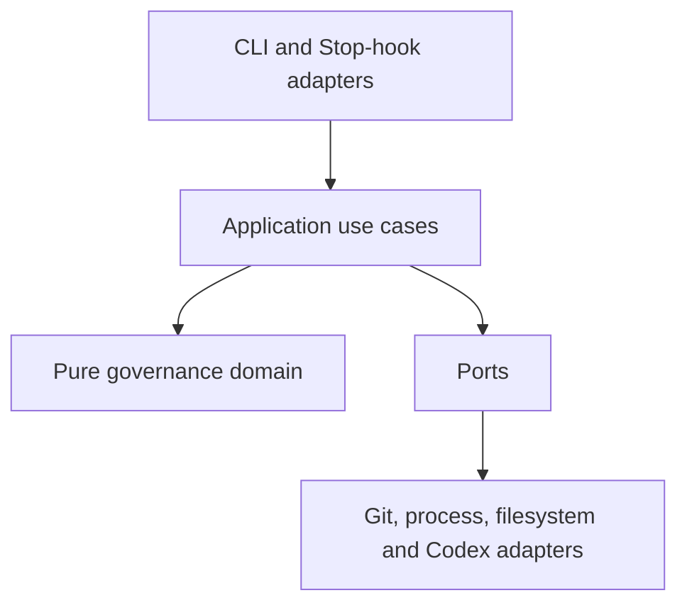
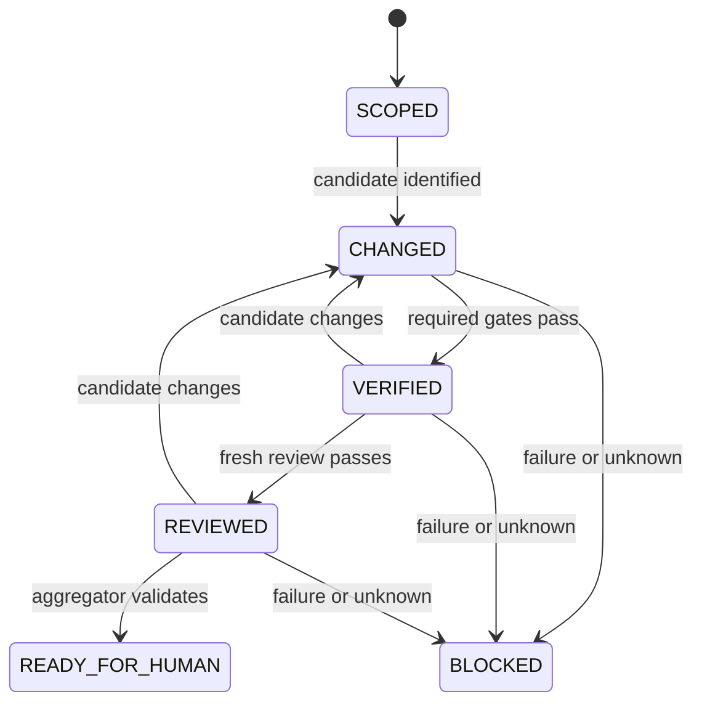

# Architecture

## Architectural style

The implementation uses a small hexagonal architecture so policy remains testable and external effects remain replaceable.



The domain has no dependency on Git, Codex, the filesystem, subprocesses, CI, wall-clock time, or JSON parsing.

## Components

### Domain

Core value objects:

- `TaskContract`
- `CandidateIdentity`
- `GateDefinition`
- `GateResult`
- `ReviewerResult`
- `EvidenceReference`
- `EvidenceManifest`
- `Waiver`
- `Disposition`
- `ClaimClassification`
- `RiskAssessment`
- `ReviewCharter`
- `RapidReviewSession`
- `RapidReviewDebrief`
- `RiskDisposition`
- `AuthenticatedDecision`
- `AssuranceClaim` and `AssuranceCase`
- `EvidenceLocator`
- `ProvenanceStatement`
- `MutationRecord`
- `ContextReceipt`

Core policies:

- candidate equality and evidence freshness;
- required-gate completeness;
- reviewer authority limits;
- fail-closed aggregation;
- governance-change authorization;
- waiver applicability;
- transition from `SCOPED` to `READY_FOR_HUMAN`.
- authenticated authority and protected risk/gate floors;
- LKG promotion and rollback applicability;
- assurance argument evaluation and disposition monotonicity;
- context-profile escalation and budget failure.

### Application use cases

- `CreateTaskContract`
- `IdentifyCandidate`
- `RunRequiredGates`
- `LaunchIndependentReview`
- `AssembleEvidenceManifest`
- `EvaluateDisposition`
- `CheckStopState`
- `VerifyGovernanceIntegrity`
- `AssessCandidateRisk`
- `PlanRapidReview`
- `EvaluateRapidReview`
- `VerifyAuthenticatedDecisions`
- `BuildProvenanceStatement`
- `CompileReviewContext`
- `RunGovernanceMutationCorpus`
- `EvaluateAssuranceCase`
- `AdmitCandidate`

Application services orchestrate ports but MUST NOT duplicate domain policy.

### Ports

| Port | Responsibility |
|---|---|
| `RepositoryPort` | Resolve repository root, base/head, diff, untracked files, submodules and immutable worktree |
| `HasherPort` | SHA-256 bytes and canonical JSON |
| `GateProcessPort` | Launch bounded commands and capture termination/output observations |
| `SandboxPort` | Establish and attest disposable no-secret/no-network candidate execution |
| `ReviewerProcessPort` | Launch a fresh isolated Codex reviewer |
| `ArtifactStorePort` | Atomically write/read artifacts without path escape |
| `PolicySourcePort` | Load and identify effective protected governance policy |
| `DecisionSourcePort` | Verify authenticated human decisions without granting them |
| `EvidenceResolverPort` | Resolve typed digest-bound artifact and excerpt locators |
| `ContextRetrievalPort` | Expose read-only full artifacts/repository and record expansions |
| `ClockPort` | Supply auditable timestamps and durations |
| `RedactorPort` | Apply declared bounded redaction before model exposure |

### Adapters

- `GitCliRepositoryAdapter`
- `Sha256HasherAdapter`
- `SubprocessGateAdapter`
- `DisposableContainerSandboxAdapter`
- `CodexExecReviewerAdapter`
- `FilesystemArtifactStore`
- `RepositoryPolicyAdapter`
- `SystemClockAdapter`
- `PatternRedactorAdapter`
- `CodexStopHookAdapter`
- `CommandLineAdapter`
- `ProtectedDecisionAdapter`
- `DeterministicContextCompilerAdapter`

## Dependency rule

```text
adapters -> application -> domain
                  ^
                ports
```

The domain imports nothing from adapters. Ports describe effects in domain terms. JSON and CLI representations are translated at the boundaries.

## State model



`BLOCKED` records `FAIL` or `UNKNOWN`; it is not an irreversible terminal state. A new candidate starts a new evidence lineage.

## Candidate identity design

### Commit mode

Preferred for CI:

```text
candidate = SHA256(canonical_json({
  repository_id,
  mode,
  base_commit,
  head_commit,
  diff_sha256,
  submodules,
  effective_policy_sha256
}))
```

The adapter independently resolves both the requested `head_commit` and actual
checkout `HEAD`, requires exact equality before constructing the candidate, and
then verifies that no uncommitted or untracked non-ignored candidate files
exist. Repository cleanliness is not a substitute for actual-HEAD equality.

### Working-tree mode

Used for local feedback:

```text
candidate = SHA256(canonical_json({
  repository_id,
  mode,
  base_commit,
  tracked_diff_sha256,
  untracked_entries,
  submodules,
  effective_policy_sha256
}))
```

The identity is recomputed immediately after every side-effecting observation. Drift invalidates the result. Non-ignored untracked entries are opened through a retained no-follow descriptor chain rooted at the repository. Regular-file bytes and executable mode and symbolic-link targets are accepted only when parent and leaf bindings remain identical after the bounded observation; pathname replacement is an unavailable identity observation.

### Canonicalization

- UTF-8 JSON with sorted keys, no insignificant whitespace, and explicit schema version.
- Repository paths use `/`, reject absolute paths and `..`, and are sorted by Unicode code point.
- File content is hashed as bytes; large files may stream but may not be sampled.
- Symlink identity includes the link target bytes, not followed file content.
- Submodules record path and exact commit. Concrete mutation-tree identity also
  recursively hashes each submodule's tracked and non-ignored untracked tree, so
  worktree drift cannot hide behind an unchanged gitlink commit.

## Reviewer process design

The application constructs an argument array rather than a shell string:

```text
codex exec
  --ephemeral
  --ignore-user-config
  --ignore-rules
  --strict-config
  --model gpt-5.6-sol
  --json
  --config default_permissions="governed_reviewer"
  --config permissions=<root-deny/workspace-read/runtime-minimum/network-off>
  --config approval_policy="never"
  --config shell_environment_policy=<fixed-non-secret-key-allowlist>
  --config model_reasoning_effort="xhigh"
  --config features.hooks=false
  --config agents.enabled=false
  --output-schema <reviewer-schema>
  --output-last-message <result-path>
  --cd <sanitized-harness-root>
  -
```

The sanitized harness is its own minimal Git root. The immutable candidate is nested at a declared read-only path. Candidate-owned `.codex`, `.agents`, hooks, rules and skills remain visible for review but are not active configuration because Codex starts at the harness root. One reviewer deadline begins before lock/policy selection and governs all candidate/authority reads, CLI-version observation, preparation, execution, cleanup, identity and final output. The reviewer adapter descriptor-reads candidate evidence only beneath the candidate repository and prompt/schema bytes only beneath a distinct protected authority root; both path families are relative to their declared root and are copied from the same validated bytes. Candidate and evidence entries plus the final output are read or copied through retained no-follow descriptors by killable helpers, and the final permission walk runs in a killable child; all use that one absolute deadline. The fixed protected prompt and normalized permitted inputs are sent on stdin. Immediately before and after execution, one composite observer independently re-identifies both the read-only copied snapshot exposed to Codex and the original source candidate; either drift makes the execution unknown. Admission receives the protected authority root separately and rebuilds stdin from its descriptor-read prompt bytes, never from a candidate-owned prompt. A custom permission profile extends Codex read-only behavior, denies the host root, re-allows only the harness and minimum detected Codex/tool runtime installation roots, and disables tool network access. Runtime roots are derived from the protected parent executable environment at launch, are never candidate inputs, and are represented in evidence only by the complete argv digest. The parent launcher environment is a narrow runtime/authentication allowlist and contains no author transcript path or API key. A second fixed allowlist governs model-generated tool processes: it replaces the parent home with a fixed synthetic value and excludes `CODEX_HOME`, proxies, authentication material and undeclared variables. Authentication remains ChatGPT/Codex-managed by the parent process; authentication files and environment values are not copied into reviewer inputs or evidence.

Launcher-closure source identity and the output schema use retained descriptor-
bound reads under that same absolute reviewer deadline; final output validation
uses the retained schema object without reopening its path. Each review mode has
one exact permitted-input key set: `evidence_root` is mandatory, and rapid-only
risk/charter keys are forbidden in conformance. Qualification compares the full
reconstructed document. Admission validation schemas resolve only beneath the
distinct protected authority root during lock selection, output preflight and
evaluation and remain retained for the locked command.

The implementation records a content-addressed reviewer-execution statement with
secrets and environment values excluded. It binds the exact mode-specific
qualification, prompt, output schema, model, launcher package closure, prepared
and post-run context receipts, reviewer output, termination, candidate pre/post
identity, separate exact-executed and semantically validated portable argv
digests plus the exact stdin digest, Codex thread/CLI versions, workflow
run/attempt, bounds, materials, primitive supervisor/capture observations,
direct event-stream references and Codex CLI-reported token usage. Admission
re-hashes both streams, reconstructs the portable sanitized argv, reconciles the
exact executed digest with the primitive launcher observation, and rebuilds exact stdin
from the protected prompt plus canonical permitted inputs, and derives the final
result, usage and execution state from those observations. Rapid-review
execution additionally material-binds exactly one risk assessment and charter.
No host path or environment value is persisted.
The retained stream bytes are deterministic evidence projections of the
complete bounded captures. For parsed command-execution events, command text and
aggregated output are replaced wholesale with fixed omission tokens while item
identity, lifecycle status and exit code remain. One fixed trusted normalization
pass then replaces supervisor-only paths and allowlisted parent-environment
values with `<REVIEWER_RUNTIME>`; stream digests bind those portable bytes.
Credentials, endpoints or host paths outside the command-event projection,
including any in final agent output, remain ambiguous. Other
credential, endpoint and generic host-path patterns are removed before
persistence and make the execution `UNKNOWN` because their causal meaning
cannot be reconstructed safely. JSONL events are parsed and deterministically
re-serialized so either replacement remains valid structured evidence.

The reviewer parent exit and result file are insufficient until a bounded stdin
writer finishes within one absolute monotonic deadline shared by process wait,
forced cleanup, stream closure and capture joins, both bounded
capture threads observe EOF and a trusted descendant boundary proves no live
reviewer descendant remains. The preferred Linux adapter uses a fresh user, PID
and mount namespace: trusted PID 1 supervises the reviewer, while the namespace
manager and outer child-subreaper remain outside the reviewer-visible PID
namespace. A bounded handshake proves namespace and `/proc` isolation before
review admission. Reviewer exit, manager exit or supervisor death tears down
the namespace, including children that call `setsid()` or `setpgid()` and close
all standard streams. When a host/container kernel blocks nested user
namespaces, a supported-architecture fallback installs `no_new_privs` and a
seccomp filter before reviewer exec. The inherited filter rejects `kill`,
thread/group/queued/pidfd signal, ptrace, cross-process-write and cross-process
resource-limit mutation syscalls, so the same-UID reviewer cannot terminate,
cripple or modify its outer child-subreaper; that
filter rejects the entire x32-tagged syscall space on x86_64 before native
dispatch so alternate-ABI syscall numbers cannot bypass the deny list. The
argument-aware filter covers both `fcntl` async ownership/status commands and
their architecture-correct Linux `ioctl` equivalents while leaving unrelated
descriptor operations available. The
subreaper then proves and performs bounded descendant cleanup. A bounded
handshake identifies either exact boundary. Other platforms or architectures
require an equivalent kernel job/containment primitive or fail closed.
Process-group checks and the outer child-subreaper
remain defence in depth, but a zombie-only procfs snapshot cannot establish
initial success because enumeration races with fork/exit. Stream closure occurs
only through a bounded helper; a blocked write or close cannot escape the
reviewer deadline. Cleanup completion is evidence and never promotes an already
incomplete run.

## Evidence storage

Default root:

```text
artifacts/governance/<candidate-id>/
├── task-contract.json
├── candidate.json
├── gates/<gate-id>/result.json
├── gates/<gate-id>/stdout.bin
├── gates/<gate-id>/stderr.bin
├── gates/manifest.json
├── reviewer/result.json
├── reviewer/execution.json
├── reviewer/context-prepared.json
├── reviewer/context-execution.json
├── rapid-review/risk-assessment.json
├── rapid-review/charters/<charter-id>.json
├── rapid-review/sessions/<session-id>.json
├── rapid-review/debrief.json
├── rapid-review/risk-disposition.json
├── manifest.json
└── disposition.json
```

Writes use temporary files in the same directory followed by a no-replacement
atomic publication step. Where directory-relative no-follow primitives are
available, directory descriptors bind traversal, temporary creation,
publication and readback to the verified parent so a concurrent symlink swap
cannot redirect output. A detected parent replacement blocks and the new leaf
is removed through the bound descriptor. Repeating the same path and identical
bytes is idempotent; any different content at an existing path blocks. The
store rejects symlinks and path escape. Artifacts are read back and rehashed before aggregation.
If those directory-relative no-follow primitives are unavailable, authoritative
artifact read/write operations block explicitly; there is no weaker pathname
fallback.
Existing leaves are opened nonblocking and accepted only after descriptor-bound
inspection proves a bounded regular file, preventing FIFO/device/socket paths
from stalling preflight or readback.
The same no-replacement rule applies to every CLI output path, including
intermediate manifests and context receipts; a command may never replace an
existing output with different bytes.

The command-line adapter traverses the evidence root with no-follow directory
descriptors, acquires the OS lock on the retained root directory descriptor
itself, and supplies that same root identity to locked preflight and every publication.
A pathname lock leaf is deliberately absent because a same-UID process can
hardlink, unlink or replace it while an older descriptor remains locked.
A different repository/root, replaced root inode, unavailable safe primitive or
contended lock blocks before the handler. It rejects
absolute paths, traversal or containment escapes, and every symlinked component
from the repository root through the output leaf. Valid output paths therefore
remain portable repository-relative artifact locations.

Gate and mutation reconstruction resolves the bounded stdout and stderr
references through retained directory descriptors and no-follow, nonblocking
leaf opens, re-hashes their bytes, reconciles declared sizes and provenance
subjects, and requires complete, non-truncated, exited termination semantics.
Capability verification must precede result start, result start must not follow
result end, provenance start/end must equal the result, and the manifest must
not predate any result completion. The reconstructed status must agree with the exit code. Missing or altered raw
streams, timeouts, signals, incomplete observations and truncation are
`UNKNOWN`, even when a schema-valid result document claims `PASS`.
Within one locked command, every digest-bound evidence reference is cached by
canonical repository root and normalized path. A later use receives the same
retained bytes, while a conflicting digest or smaller byte bound fails closed;
policy, qualification, reconstruction and disposition therefore cannot observe
different pathname generations.

Sandbox admission reconstructs execution identity from the protected provider,
pinned image, canonical command, provider version and exact process, memory, CPU,
timeout and output bounds. Those inputs are explicit capability fields and must
match protected policy and provenance. Cleanup permanently records any mismatch
between the original immutable container ID/name pair, including later rename or
same-name substitution; later absence cannot erase that uncertainty.
Container creation and cleanup read the supervisor-owned ID file only through a
bounded no-follow descriptor under the transaction deadline, retaining the
verified bytes across parsing rather than checking and reopening a pathname.

Each candidate directory includes provenance statements, authenticated-decision
references, a context receipt, mutation records and a deterministic assurance
case. Their content IDs omit exactly the document's own top-level ID before
canonical hashing. A protected stable `repository_id` is present in every
authority-bearing subject.

Gate, mutation and reviewer producers retain their own workflow/run identities.
Causal content-addressed materials and subjects relate those distinct runs;
aggregation never requires unrelated producers to claim the same workflow.
Gate and mutation implementation identity is the digest of a canonical,
filename- and length-framed manifest covering every Python file in the trusted
package, with the producer kind framed separately.

Before gate or reviewer streams are persisted, one shared protected normalizer
replaces exact host and supervisor values and recognized credential-, complete
host-root-path-, address- and named-endpoint-shaped values. Exact proxy
environment values are credential-class values. Every replacement category and
count is recorded. Secret-shaped replacement makes the observation ambiguous and
therefore `UNKNOWN`; known supervisor-path normalization alone does not erase the
underlying exit observation.

Context evidence is a four-link chain: typed protected source bundle, exact
projection, prepared receipt and post-run execution receipt. The evidence
manifest references the first three directly, and admission reconstructs their
digests, repository closure, adverse-signal profile selection, inclusion choices,
metrics and separately referenced protected profile/version qualification before
accepting usage. Reviewer process provenance names the source bundle, projection,
qualification, prepared receipt and post-run receipt as distinct materials.

## Configuration

Configuration sources, from low to high precedence:

1. built-in safe defaults;
2. protected repository policy;
3. task contract values explicitly permitted by policy;
4. CLI options explicitly permitted by policy.

Environment variables do not silently override governance policy. The resolved effective configuration is serialized, redacted, hashed, and referenced by evidence. General authoritative JSON documents and their schemas are read once through the same retained no-follow, nonblocking, bounded descriptor adapter used for repository evidence; parsing and command use consume that observation without pathname reopening.

`schemas/effective-policy.schema.json` is the portable protected-policy representation. It uses repository-relative paths and argument arrays; it contains no developer path, hostname, endpoint, credential, or environment-derived value. A deployment may replace the example only through protected governance review.

## Failure semantics

Exceptions are translated only at adapter boundaries:

- known candidate defect -> `FAIL`;
- unavailable or incomplete observation -> `UNKNOWN`;
- policy or authorization violation -> `BLOCK`;
- implementation/internal error affecting proof -> `UNKNOWN/BLOCK`.

There is no generic catch that converts a known block into a softer unknown or converts unknown into pass.

## Rapid-review policy boundary

Rapid-review planning and aggregation are pure domain policy. The model-facing adapter may investigate and produce a structured session report, but it cannot declare its artifacts complete, accept a finding or residual risk, or change disposition. The application validates exact candidate and charter digests, provenance, direct oracle/evidence linkage, coverage and omission reporting, session status, three-story debrief completeness, and human authorization for material acceptance.

Protected changed-surface obligations and the authenticated task define a
minimum risk and rapid-review floor. A candidate-supplied risk assessment may
escalate that floor but cannot lower its risk profile, mandatory charter count,
or required-review flag. An attempted downgrade is a confirmed policy block.

The same sanitized reviewer harness is used with the rapid-review session schema and additional allowlisted risk-assessment and charter references. Candidate instructions remain inactive evidence. Any candidate mutation starts a new evidence lineage.

## Admission reference monitor

The admission kernel is a pure domain function consuming already verified domain
values. It has no filesystem, process, network, credential, repository-setting,
merge, deployment or waiver-granting adapter. The application resolves all
references and authenticated decisions first, then presents fixed assurance
claims and defeaters. Only this kernel may produce `READY_FOR_HUMAN`.
Context preparation instead emits `CONTEXT_READY`; this state is only a
prerequisite observation and has no admission authority.

Content-addressed decision bytes are not authentication. Every decision policy
also requires its `decision_id` in the explicit result of the protected
decision-source adapter. The default set is empty; absence or mismatch therefore
cannot be recovered from issuer prose embedded in the decision.

The previous LKG effective policy becomes classifier authority only after an
authenticated protected-source decision binds its digest to the exact task,
candidate and base commit and its `lkg_governance_commit` equals that base. Its
`governance_paths` enumerate the complete trusted implementation and deployment
closure. A matching candidate requires separately referenced proposed-policy,
promotion-decision and rollback artifacts. Rollback evidence references a
policy-defined rollback gate result, capability and provenance statement; the
protected producer runs that gate separately from task-selected gates with the
rollback module supplied by a read-only materialization containing exactly the
previous-LKG package producer manifest's verified paths and bytes beneath the
package import root, with no broader source-tree siblings and Python site loading
disabled, and binds the proposed policy plus authenticated base. Admission
re-hashes and reconstructs
their raw streams, execution semantics, producer identity, chronology, exact
argv, machine-readable target and absence of limitations before invoking the LKG
promotion predicate.

CI uses the kernel from the previous protected LKG governance commit. Its final
job runs regardless of direct dependency status, validates that every dependency
is exactly `success`, reconstructs required artifacts, and exits nonzero for any
other state. Candidate workflow text is evidence, not the authority source.

## Untrusted gate execution

The host supervisor creates a fresh disposable candidate/build copy for each
gate and asks a sandbox adapter to enforce the protected capability policy. A
writable copy never becomes the input to a sibling gate and is removed with the
disposable supervisor state. The supervisor independently identifies every exact
executed gate, baseline and mutant copy before and after execution; mutation
source identity also frames the complete concrete Git-visible tree, recursively
including Git-visible submodule worktree bytes as well as each submodule commit.
Reviewer
snapshots receive the same post-copy identity check. Gate submodules are cloned
locally and checked out at their candidate-bound commits, excluding ignored
working-directory content; dirty/unavailable submodule worktrees fail closed,
and the current MVP blocks reviewer execution for non-empty submodule sets until
immutable recursive object materialization is available. Candidate processes receive
no authoritative evidence or governance mount and no inherited secret. The
sandbox output channel is bounded and untrusted. Protected gate argv is
self-contained: src-layout Python test gates declare `PYTHONPATH=src` through
the command array and cannot inherit a developer or supervisor import path.
Each per-gate timeout becomes one absolute deadline before the fresh candidate
copy begins. Clone, checkout, submodule reconstruction, copy identity,
container creation, execution and cleanup receive the unchanged applicable
absolute deadline and derive remaining subprocess time only at the launch site;
incomplete preparation emits retained `UNKNOWN` evidence without launching the
gate. Container-backed invocations
first complete a bounded create transaction using a runtime-only supervisor-owned
name and ID file; the immutable ID and name are validated before an attached
start. On normal exit, timeout, interruption, or provider-CLI failure the
supervisor forcibly removes that exact ID and proves both ID and name absent;
failure to establish absence is incomplete observation. After process-tree termination,
the trusted supervisor's composite observer re-identifies both the live source
and executed copy and packages outputs into the
write-once store. A provider capability mismatch is `UNKNOWN`; the supervisor
does not fall back to a host subprocess.

Mutation preparation applies the same rule per operator: an exact-command
unmodified control copy must survive first; the producer then identifies the
source before a distinct mutant copy, identifies that unmodified copy,
re-identifies the source, and only then derives and applies the expected mutation
in that verified copy. Control and mutant execution each have a bounded absolute
deadline. Recursive file, Git and submodule-tree observations share the relevant
deadline; preparation or control uncertainty is retained as `UNKNOWN` without
mutation kill credit.

The curated mutation probe is protected producer code, not candidate harness
logic. Every mutant has a separately verified unmodified control run with the
identical expanded argv and sanitized environment; it must produce `SURVIVED`
before mutation. No probe target or control/mutant metadata is exposed to
candidate tests. It accepts only a fixed command-template grammar, resolves the protected
probe-source and mutated-path sentinels, compiles the mutated Python target,
invokes the selected tests with site initialization isolated, and emits one
terminal structured observation. The expanded command is the selected command:
the mutant record, gate result, sandbox capability and executed argv must be
identical. `KILLED` requires a distinct protected exit code plus proof that at
least one selected test ran and the final unittest result contained assertion
failures but no import, discovery, harness or execution errors. All other
non-success results are `INVALID` or `UNKNOWN`.

## Context compiler

The deterministic compiler re-identifies the candidate from the exact repository
and effective policy, then derives a conservative affected closure as the full
Git-visible repository inventory plus changed paths, excluding only the declared
evidence root. This includes unchanged dependencies, callers, contracts and
tests without trusting a language-specific or caller-selected graph. It rejects
a caller changed-file list or affected closure that differs from those protected
derivations; a coarse directory summary cannot replace either inventory. The
closure is content-bound into the projection and receipt. The compiler produces COMPACT,
STANDARD or DEEP projections
with a stable protected prefix and candidate-specific content-addressed delta.
The assurance kernel is indivisible. Other evidence follows progressive
disclosure, and all exclusions/retrieval expansions are recorded in the
candidate-bound prepared receipt. After a model invocation, the trusted launcher
emits a separate content-addressed execution receipt linked to the prepared
receipt and reviewer output. It records every reported retrieval plus actual
Codex JSONL usage; missing event usage or a receipt mismatch blocks. Budget
insufficiency escalates or blocks.

The compiler never receives the author transcript or persisted reasoning. The
fresh-context reviewer can search the complete read-only repository and resolve
unabridged artifacts, but the prompt initially contains only the deterministic
projection.

## Concurrency

MVP runs one governance observation-through-publication command per working
tree. A non-blocking OS-backed lock beneath the evidence root covers the complete
command lifetime and prevents concurrent candidate observation, copying,
execution and publication. The workflow must serialize the full multi-command
pipeline; command-level lock contention is `UNKNOWN/BLOCK`, not a reason to
proceed without evidence. Review runs against an independently re-identified,
read-only detached snapshot where possible.
