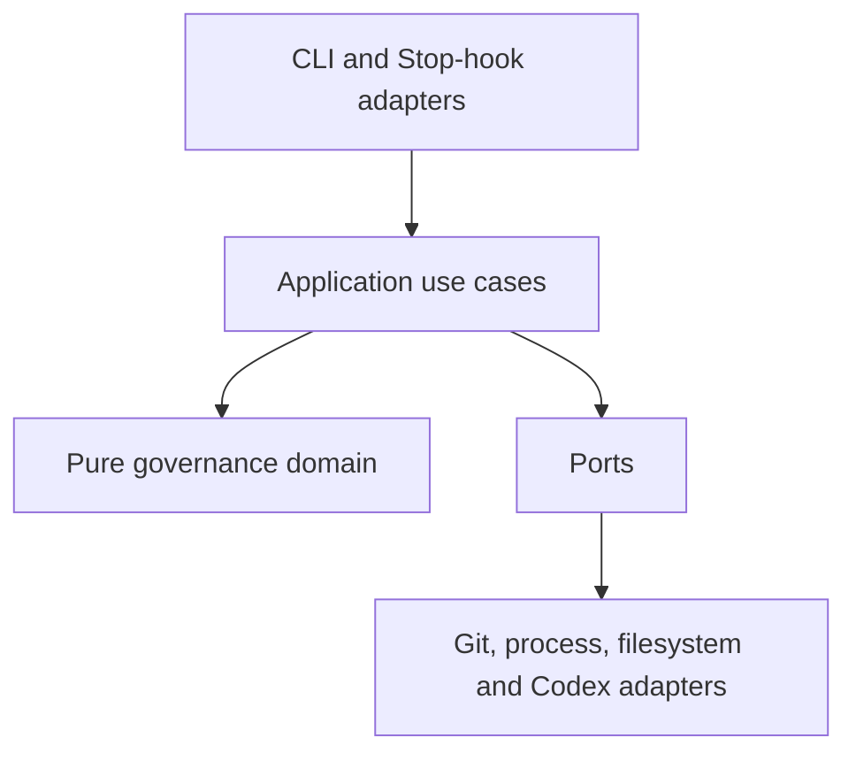
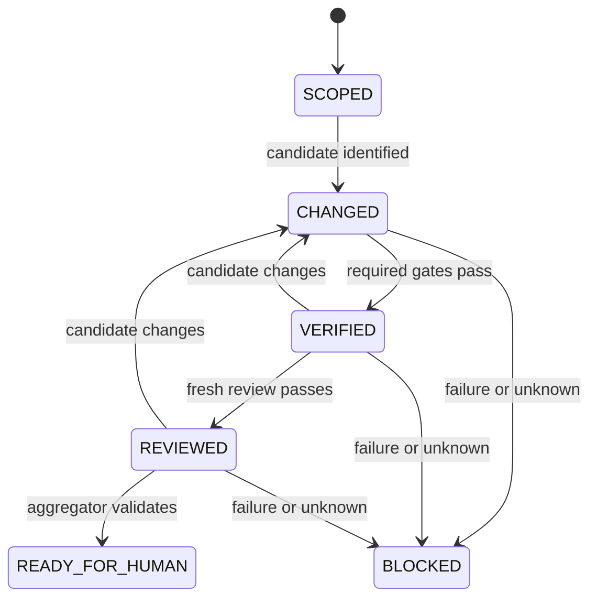

# Architecture

## Architectural style

The implementation uses a small hexagonal architecture so policy remains testable and external effects remain replaceable.



The domain has no dependency on Git, Codex, the filesystem, subprocesses, CI, wall-clock time, or JSON parsing.

## Components

### Domain

Core value objects:

- `TaskContract`
- `CandidateIdentity`
- `GateDefinition`
- `GateResult`
- `ReviewerResult`
- `EvidenceReference`
- `EvidenceManifest`
- `Waiver`
- `Disposition`
- `ClaimClassification`

Core policies:

- candidate equality and evidence freshness;
- required-gate completeness;
- reviewer authority limits;
- fail-closed aggregation;
- governance-change authorization;
- waiver applicability;
- transition from `SCOPED` to `READY_FOR_HUMAN`.

### Application use cases

- `CreateTaskContract`
- `IdentifyCandidate`
- `RunRequiredGates`
- `LaunchIndependentReview`
- `AssembleEvidenceManifest`
- `EvaluateDisposition`
- `CheckStopState`
- `VerifyGovernanceIntegrity`

Application services orchestrate ports but MUST NOT duplicate domain policy.

### Ports

| Port | Responsibility |
|---|---|
| `RepositoryPort` | Resolve repository root, base/head, diff, untracked files, submodules and immutable worktree |
| `HasherPort` | SHA-256 bytes and canonical JSON |
| `GateProcessPort` | Launch bounded commands and capture termination/output observations |
| `ReviewerProcessPort` | Launch a fresh isolated Codex reviewer |
| `ArtifactStorePort` | Atomically write/read artifacts without path escape |
| `PolicySourcePort` | Load and identify effective protected governance policy |
| `ClockPort` | Supply auditable timestamps and durations |
| `RedactorPort` | Apply declared bounded redaction before model exposure |

### Adapters

- `GitCliRepositoryAdapter`
- `Sha256HasherAdapter`
- `SubprocessGateAdapter`
- `CodexExecReviewerAdapter`
- `FilesystemArtifactStore`
- `RepositoryPolicyAdapter`
- `SystemClockAdapter`
- `PatternRedactorAdapter`
- `CodexStopHookAdapter`
- `CommandLineAdapter`

## Dependency rule

```text
adapters -> application -> domain
                  ^
                ports
```

The domain imports nothing from adapters. Ports describe effects in domain terms. JSON and CLI representations are translated at the boundaries.

## State model



`BLOCKED` records `FAIL` or `UNKNOWN`; it is not an irreversible terminal state. A new candidate starts a new evidence lineage.

## Candidate identity design

### Commit mode

Preferred for CI:

```text
candidate = SHA256(canonical_json({
  mode,
  base_commit,
  head_commit,
  diff_sha256,
  submodules,
  effective_policy_sha256
}))
```

The adapter verifies that the checkout tree matches `head_commit` and that no uncommitted or untracked non-ignored candidate files exist.

### Working-tree mode

Used for local feedback:

```text
candidate = SHA256(canonical_json({
  mode,
  base_commit,
  tracked_diff_sha256,
  untracked_entries,
  submodules,
  effective_policy_sha256
}))
```

The identity is recomputed immediately after every side-effecting observation. Drift invalidates the result.

### Canonicalization

- UTF-8 JSON with sorted keys, no insignificant whitespace, and explicit schema version.
- Repository paths use `/`, reject absolute paths and `..`, and are sorted by Unicode code point.
- File content is hashed as bytes; large files may stream but may not be sampled.
- Symlink identity includes the link target bytes, not followed file content.
- Submodules record path and exact commit.

## Reviewer process design

The application constructs an argument array rather than a shell string:

```text
codex exec
  --ephemeral
  --ignore-user-config
  --ignore-rules
  --model <configured-gpt-5.6>
  --sandbox read-only
  --config model_reasoning_effort="xhigh"
  --config features.hooks=false
  --config agents.enabled=false
  --output-schema <reviewer-schema>
  --output-last-message <result-path>
  --cd <sanitized-harness-root>
  -
```

The sanitized harness is its own minimal Git root. The immutable candidate is nested at a declared read-only path. Candidate-owned `.codex`, `.agents`, hooks, rules and skills remain visible for review but are not active configuration because Codex starts at the harness root. The fixed protected prompt and normalized permitted inputs are sent on stdin. The launcher environment is an allowlist and contains no author transcript path. Authentication remains Codex-managed, but its files are not copied into evidence.

The implementation records an invocation descriptor with secrets and environment values excluded.

## Evidence storage

Default root:

```text
artifacts/governance/<candidate-id>/
├── task-contract.json
├── candidate.json
├── gates/<gate-id>/result.json
├── gates/<gate-id>/stdout.bin
├── gates/<gate-id>/stderr.bin
├── reviewer/result.json
├── manifest.json
└── disposition.json
```

Writes use temporary files in the same directory followed by atomic replacement. The store rejects symlinks and path escape. Artifacts are read back and rehashed before aggregation.

## Configuration

Configuration sources, from low to high precedence:

1. built-in safe defaults;
2. protected repository policy;
3. task contract values explicitly permitted by policy;
4. CLI options explicitly permitted by policy.

Environment variables do not silently override governance policy. The resolved effective configuration is serialized, redacted, hashed, and referenced by evidence.

## Failure semantics

Exceptions are translated only at adapter boundaries:

- known candidate defect -> `FAIL`;
- unavailable or incomplete observation -> `UNKNOWN`;
- policy or authorization violation -> `BLOCK`;
- implementation/internal error affecting proof -> `UNKNOWN/BLOCK`.

There is no generic catch that converts a known block into a softer unknown or converts unknown into pass.

## Concurrency

MVP runs one governance pipeline per working tree. A lock under the evidence root prevents concurrent writers. Review runs against an immutable detached worktree where possible. Lock contention is `UNKNOWN/BLOCK`, not a reason to proceed without evidence.
