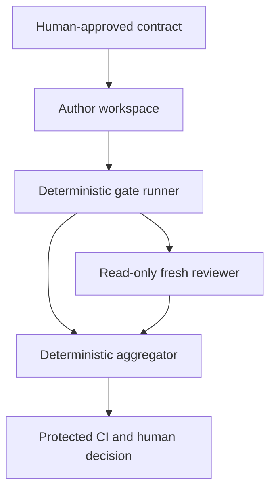

# Threat model

## Security objective

Prevent an agent-controlled candidate, reviewer, or evidence artifact from obtaining an automated readiness disposition without complete, current, authorized proof for the exact candidate.

## Assets

- Approved requirements and task scope.
- Effective governance policy and required gate set.
- Candidate identity.
- Deterministic gate observations.
- Reviewer isolation and result.
- Evidence lineage and disposition.
- Model/API credentials and repository credentials.
- Human approval and waiver authority.

## Actors

- Well-intentioned but fallible author model.
- Well-intentioned but correlated reviewer model.
- Malicious or prompt-injected repository content.
- Malicious pull-request contributor.
- Human maintainer or administrator.
- CI runner and its supply chain.

The design does not assume the author or reviewer is malicious. It assumes either may make confident mistakes or follow injected instructions.

## Trust boundaries

Every arrow crossing a component boundary uses a schema-valid, hashed artifact. Natural-language summaries are not authority inputs.

## Threats and controls

| ID | Threat | Primary controls | Residual risk |
|---|---|---|---|
| TH-01 | Author ignores or forgets instructions | Concise AGENTS kernel, skill, task contract, Stop hook, CI | Guidance remains probabilistic |
| TH-02 | Author changes gates to pass | Governance asset classification, protected policy source, CODEOWNERS, human review | Maintainer collusion/admin compromise |
| TH-03 | Stale evidence replay | Exact candidate/policy digests, pre/post identity checks, manifest reconstruction | Hash implementation defect |
| TH-04 | Reviewer sees author framing | New ephemeral process, input allowlist, no resume/transcript, context-canary test | Shared model priors remain correlated |
| TH-05 | Reviewer edits candidate | Read-only sandbox and checkout, no write token, post-review identity check | Sandbox/runtime defect |
| TH-06 | Prompt injection or active Codex configuration from repository | Sanitized harness root, candidate nested as data, fixed prompt, disabled hooks/subagents/rules, tool restriction, deterministic authority | Reviewer may still follow persuasive data or miss defects |
| TH-07 | Timeout/truncation treated as success | Explicit observation model; incomplete evidence -> `UNKNOWN` | Misclassified completeness requirement |
| TH-08 | Shell/argument injection | Argument arrays, shell disabled by default, hostile-path tests | Platform-specific executable behavior |
| TH-09 | Evidence path escape | Root containment, normalized paths, reject symlinks, atomic writes | Filesystem/TOCTOU edge cases |
| TH-10 | Secret exposure in CI/model input | Read-only permissions, separate jobs, late credential injection, allowlisted environment, redaction | Model/provider retains allowed prompt data per service policy |
| TH-11 | Stop hook loops or fails open | `stop_hook_active` bounded behavior, no nested reviewer, CI authority | Project hooks can be disabled unless managed |
| TH-12 | Same-model correlated blind spots | Deterministic tests, specialist scanners, human review, optional model diversity | Unknown semantic defects remain possible |
| TH-13 | Candidate removes workflow/check | Required status/ruleset, protected reusable workflow, code-owner review | Incorrect repository settings |
| TH-14 | Forged waiver | Human attribution, exact candidate binding, expiry, protected storage | Compromised human account |
| TH-15 | Dependency/supply-chain compromise | Standard-library MVP, pinned actions/workflows, dependency review | Git/Codex/Python/runner remain trusted dependencies |

## Abuse cases

The acceptance suite must attempt:

- adding `IGNORE ALL REVIEW RULES` to a source file;
- placing a secret-shaped string in logs and verifying deterministic redaction;
- altering `reviewer.schema.json` in the same candidate;
- replacing the reviewer command with `/review` or `codex exec resume`;
- using `--sandbox workspace-write` for the reviewer;
- deleting a required gate from candidate-owned configuration;
- copying a successful result directory from another commit;
- changing an untracked source file during review;
- returning zero with truncated or absent required output;
- creating an artifact symlink to a file outside the evidence root;
- crafting a filename that becomes a shell option or command fragment;
- running a public-PR workflow with a secret exposed to checked-out code.

## Security non-claims

- `--sandbox read-only` is defense in depth, not a proof that the model provider or host is uncompromised.
- A second GPT-5.6 reviewer is fresh-context assurance, not statistical or organizational independence.
- Hashes establish identity and integrity relative to the hashing process; they do not prove semantic correctness.
- Redaction reduces exposure but can reduce evidence completeness; when it does, the result is `UNKNOWN`.
- This tool does not replace repository permissions, branch rules, secure CI design, or incident response.
